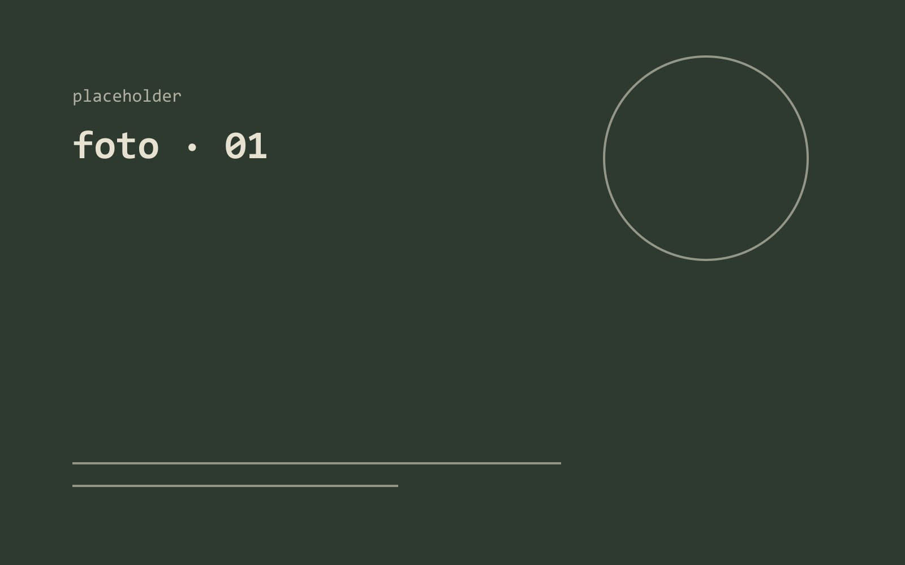
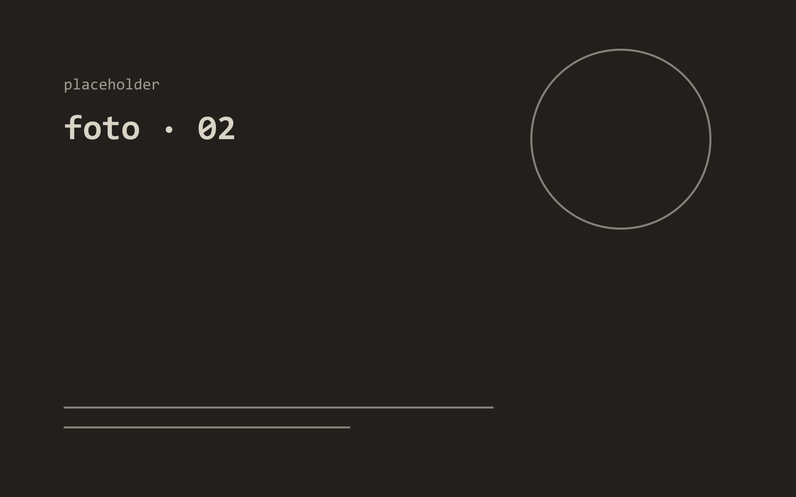

fotograafia on hea silma arendaja ning aitab
ümbruskonda analüütilisemalt jälgida, mistõttu on ta ka hea tööriist
arhitektuuri uurimisel ja loomisel.

with photography one is able to study urban
space more analytically, which makes photography an important tool for
analysing and therefore creating architecture.

pildistan peamiselt analoogkaameratega ning
mul on kogemust pimikus töötamisega.

i mainly use analog cameras for taking photos and i have experience
in working in darkrooms.

two of the frames i'm keeping; the rest stay in the binder.
